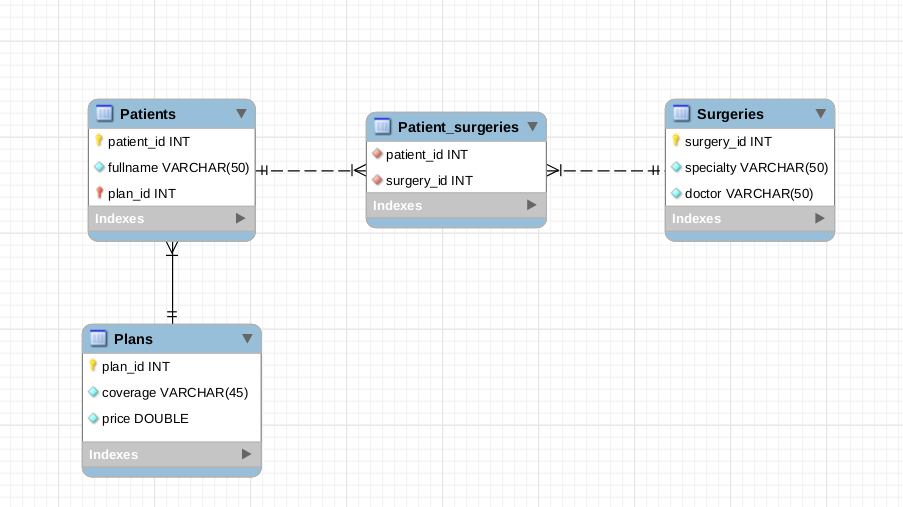

# Boas-vindas ao repositório do exercício do dia `24.2 - ORM - Associations`


Esse é o exercício do conteúdo do dia `24.2 - ORM - Associations`. Esse exercício vai consolidar as seguintes habilidades:

* Criar modelos
* Relacionar dois modelos com hasMany
* Relacionar dois modelos com belongsTo
* Relacionar dois modelos com belongsToMany
* Utilizar eager loading ou lazy loading

### Orientações

<details>
  <summary><strong> ⌨️ Antes de iniciar</strong></summary>

  Crie um fork desse projeto e para isso siga esse [tutorial de como realizar um fork](https://guides.github.com/activities/forking/).

  Após feito o fork, clone o repositório criado para o seu computador.

  Rode o `npm install`.

  Vá para a branch master do seu projeto e execute o comando:

  git branch

  Mude para a branch sequelize-associations com o comando git checkout -b sequelize-associations. É nessa branch que você realizará a solução para o exercício.

  Observe o que deve ser feito nas instruções.

  Após a solução dos exercícios, abra um PR no seu repositório forkado e, se quiser, mergeie para a master, sinta-se a vontade!

  **Atenção!** Quando for criar o PR você irá se deparar com essa tela:

  

  É necessário realizar uma mudança. Clique no *base repository* como na imagem abaixo:

  

  Mude para o seu repositório. Seu nome estará na frente do nome dele, por exemplo: `antonio/exercise-sequelize-associations`. Depois desse passo a página deve ficar assim:

  

  Agora basta criar o PULL REQUEST clicando no botão `Create Pull Request`.

  Para cada PR realize esse processo.
</details>

### Antes de começar os exercícios

Nesse exercício vamos criar uma API que será responsável pela gestão de um sistema de saúde. Nesse sistema terão pacientes, cada um com seu plano. Cada paciente pode ter realizado várias cirurgias, que por sua vez, devem ser listadas e categorizadas. O diagrama abaixo demonstra como o banco de dados se comportará:



Este repositório já contém as dependências abaixo no `package.json`. Execute `npm install` para instalá-las.

- express
- nodemon
- sequelize
- mysql2
- sequelize-cli

O exercício já vem com a estrutura básica do Sequelize configurada, **não será necessário inicializar ou criar migrations ou seeders para as tabelas**, pois ela já estão feitas. 

Será necessário configurar o arquivo `config/config.js` com os dados de seu servidor. Para isso, crie um arquivo .env para configurar suas variáveis de ambiente. O arquivo .env.example contém um exemplo das variáveis de ambiente que devem ser configuradas

Após, utilize os comandos abaixo:

```bash
npx sequelize db:create
npx sequelize db:migrate
npx sequelize db:seed:all
```

Esses comandos vão criar respectivamente, a `database`, as `tables` e após, inserir dados exemplos nas tabelas.

As tabelas criadas são:

- Patients
- Patients_surgeries
- Plans
- Surgeries

Feito isso, ja podem ser realizados os exercícios abaixo.


### Exercícios

#### 🚀 Exercício 1

Crie o model de `Plans`.

#### 🚀 Exercício 2

Crie o model de `Patients`.

#### 🚀 Exercício 3

Crie o model de `Surgeries`.

#### 🚀 Exercício 4

Crie o model de `Patient_surgeries`.

#### 🚀 Exercício 5

Crie um endpoint que liste todos os pacientes e seus respectivos planos.

#### 🚀 Exercício 6

Crie um endpoint que liste todos os pacientes e suas respectivas cirurgias realizadas.

#### 🚀 Exercício 7

Crie um endpoint que de acordo com o id de um plano, que deve ser recebido via requisição, liste os pacientes que o possuem.

### Bônus

#### 🚀 Exercício 1 

Crie um endpoint capaz de adicionar um novo paciente.

#### 🚀 Exercício 2

Crie um endpoint que liste todos os pacientes e suas cirurgias realizadas, mas oculte o nome do médico responsável.

#### 🚀 Exercício 3

Crie um endpoint que de acordo com o nome do médico, que deve ser recebido via requisição, liste todas as cirurgias realizadas pelo mesmo, um get na url `http://localhost:3000/surgeries/Rey%20Dos%20Santos`deve retornar as cirurgias realizadas pelo médico `Rey Dos Santos`.
